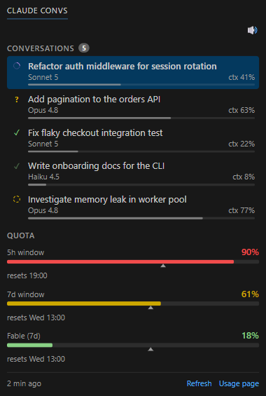

# Claude Convs — Conversations & Quota Panel



**See which of your Claude Code conversations are actually working, click one to jump straight to its tab — in any VS Code window, even a hidden one — and hear the difference between "done" and "Claude needs you".**

Most Claude Code usage trackers on the Marketplace stop at a status-bar percentage. This one is a full panel, docked in the **Secondary Side Bar** (right side):

- **Every conversation in the current workspace, with live state** — working / waiting for you / done / stale — not just the tab dot VS Code's own extension shows (a blue dot for a pending permission, an orange one for a finished hidden tab — nothing at all for a conversation asking you a question). A finished conversation keeps a **bright ✓ until you've read it** ([read receipts](#read-receipts))
- **Click a row → the right tab comes to the front**, in any editor group, **in any VS Code window** — VS Code exposes no API to do this, so the panel works around it (see [Clicking a conversation](#clicking-a-conversation))
- **Two distinct sounds** — one when a conversation finishes, a different one when Claude is waiting on you (a question, a permission prompt) — so you don't have to keep the panel visible to notice ([Sounds](#sounds); off by default)
- **A quota bar per active window** — 5h, 7d, and any model-scoped weekly limit the API is currently reporting (e.g. a promotional Fable allowance) — coloured by **projected pace** (are you on track to run out before the reset, not just "how full does it look right now"), with a **▲ marker** showing where you "should" be at this instant if you paced usage evenly across the window
- Click **Usage page** → opens `https://claude.ai/settings/usage`

> **Windows only**, and talks to an Anthropic endpoint that **isn't part of the documented public API** — see [Requirements](#requirements) and [Known limitations](#known-limitations) before installing.

> **v1.x note.** Earlier versions (`< 2.0.0`) shipped a status bar item instead. It has been **removed**: the panel carries strictly more information (per-conversation state, not just the current tab) with real formatting a status bar text segment can't do (colour, bars, spinners). See `CHANGELOG.md`.

> **Unofficial.** This extension is not affiliated with, endorsed by, or supported by Anthropic. "Claude" and "Claude Code" are trademarks of Anthropic, PBC.

## Why

VS Code's own Claude Code extension doesn't show which of your open conversations are actually working — only a blue dot for a pending permission, orange for a finished hidden tab (Anthropic feature request [#34309](https://github.com/anthropics/claude-code/issues/34309)). And the CLI's quota is only visible on request. This panel keeps both visible at all times, reactively.

## Opening the panel

The Secondary Side Bar is a VS Code 1.106+ feature. If the **Claude Convs** icon isn't visible in the right sidebar, open it via **View → Appearance → Secondary Side Bar**, then find "Claude Convs" in the activity bar that appears on the right — or run the command **Claude Code Quota: Open Usage Page** once to trigger activation, then look for the icon. It stays docked once opened.

## How it works

The extension has two fetch paths and falls back between them:

1. **Cookie path (primary, since 1.4.0).** A raw `https.get()` to `claude.ai/api/organizations/{org_id}/usage` with `cookie: sessionKey=...`. The `sessionKey` cookie alone is sufficient (verified empirically — no Cloudflare challenge from a residential IP on this authenticated endpoint). The cookie is cached at `~/.claude/quota-session-key.json`. **No browser running steady-state.**

   When the cache is empty or the session has rotated (~once every 30 days), the extension spawns a dedicated Brave instance ephemerally (`--user-data-dir=<claudeCodeQuotaBar.braveUserDataDir>`, port 9223, offscreen), reads the `sessionKey` via browser-level CDP `Storage.getCookies`, then kills Brave immediately. Typical refresh: ~10 seconds.

   **Requires `claudeCodeQuotaBar.braveUserDataDir` to be set** (empty by default — see [Configuration](#configuration)). With no path configured, this path is skipped entirely: no browser spawn attempt, no error, straight to the OAuth fallback below. Set it once to a Brave user-data directory with a `claude.ai` session logged in and this becomes the primary path again.

2. **OAuth fallback.** If the cookie path fails entirely (Brave not installed, no claude.ai session in the Octopus profile, network hiccup), the extension reads your local Claude Code OAuth token from `~/.claude/.credentials.json` and calls `api.anthropic.com/api/oauth/usage` directly. This endpoint is currently subject to persistent rate-limiting (Anthropic issues [#31021](https://github.com/anthropics/claude-code/issues/31021), [#31637](https://github.com/anthropics/claude-code/issues/31637)), which is why it is the fallback rather than the primary path.

Results are cached at `~/.claude/usage-cache.json` so the bar shows something useful even when both paths fail. Refresh runs every 5 minutes by default (configurable).

**Event-driven top-up.** During a fast burn, waiting for the next 5-minute tick can leave the panel visibly behind the real usage. Whenever a conversation transitions to `done` or `waiting` — the moment a chunk of usage was just billed — the extension fetches immediately, on top of the regular poll. Throttled to at most one event-driven fetch per ~45 s (several conversations finishing in a burst still cost one fetch), skipped while the panel is hidden, and never triggered by a conversation going `busy` or by a recompute that leaves every conversation's state unchanged (e.g. context % moving mid-run).

You must already be signed into Claude Code for OAuth fallback, AND have a `claude.ai` session logged into the Brave Octopus profile for the cookie path. The extension does not perform any login flow itself.

## Model and context occupation, per conversation

Each conversation row shows the **model actually served for that session** and its **context-window occupation** (`ctx NN%`), both read straight from that conversation's own transcript (`~/.claude/projects/<workspace>/<session_id>.jsonl`) — never from a shared/global file, so one session can never pollute another's display.

- **Model**: `message.model` of the last assistant entry in the transcript. **No hardcoded model list** — a `claude-opus-4-8 → Opus 4.8` lookup table is wrong the day a model ships or is pulled (lived experience: Fable 5 appearing then being suspended made a hardcoded table display nonsense). `hooks/model-id.js` parses the id *schema* instead, which is stable — `claude-<family>-<major>[-<minor>][-<date>][[<tag>]]` — so `claude-opus-4-8[1m]` → `Opus 4.8`, `claude-fable-5` → `Fable 5`, `claude-haiku-4-5-20251001` → `Haiku 4.5`. An id that doesn't match the schema is shown **raw** rather than as an invented name, so a new scheme is immediately visible.
- **Context occupation** (`ctx NN%`): the same transcript entry also carries `message.usage`; occupation is `input_tokens + cache_read_input_tokens + cache_creation_input_tokens` divided by the detected window size. No extra source, no network call — same number `/context` would report.

The denominator (200k vs 1M) is **auto-detected** by `hooks/model-id.js`, most-certain signal first:

1. `CLAUDE_CODE_DISABLE_1M_CONTEXT=1` → **200k**, you've decided.
2. **Empirical guard** — any observed usage above 200k *is* a 1M session (Claude Code auto-compacts before 200k otherwise). Imparable, so it comes before every heuristic.
3. **`[1m]` tag on the served model id** (`claude-opus-4-8[1m]`) → 1M.
4. **`[1m]` alias** in `settings.json` `model` (e.g. `"sonnet[1m]"`) → 1M. Covers the Sonnet / Opus 4.6 opt-in.
5. **Family heuristic** (`opus-4-7/4-8`, `fable-5`) — last resort, hardcoded and doomed to age. It only matters in the first turns of a conversation (usage still under 200k) on a model whose id carries no `[1m]` tag; guessing wrong there only understates `ctx:%` until usage crosses 200k.
6. Otherwise **200k**.

## Conversation state engine

`state.js` tells you **which conversations are working**, which VS Code itself doesn't expose (only a blue dot for a pending permission, orange for a hidden finished tab — Anthropic feature request [#34309](https://github.com/anthropics/claude-code/issues/34309)). It aggregates, for the current workspace:

- `~/.claude/sessions-state.json` — state written by hooks (below)
- `~/.claude/projects/<workspace>/*.jsonl` — real model, `ctx:%`, title, activity (`mtime`)
- `~/.claude/active-session.json` — which conversation received the last prompt (model display; also the highlight's fallback when the window never had a Claude tab selected — the highlighted row otherwise follows the currently selected tab, per window)

Reactive by design: `fs.watch` on both directories → instant push. **No 5-minute poll for state** (the poll only survives for the network quota).

### States

| State | Icon | Meaning |
|---|---|---|
| `busy` | spinning arc | Working (`UserPromptSubmit` fired, transcript still moving) |
| `waiting` | **?** | Hands you back control — **whatever the form**: a permission dialog, a question, a plan to approve, an MCP elicitation, an agent asking for input. One icon, one sound, for all of them — see below |
| `done` | **bright ✓** / dim ✓ | Finished replying (`Stop`). Bright until you've actually read it — see [Read receipts](#read-receipts) |
| `stale` | dashed circle | Claimed `busy` but the transcript has been silent for 5+ min → zombie (crash, killed process, VS Code closed without `SessionEnd`). **Display only — nothing is ever killed.** |
| `interrupted` | hollow square | You stopped it yourself (Stop button / Esc) mid-turn. Read from the transcript, since no hook fires on an interrupt ([#45289](https://github.com/anthropics/claude-code/issues/45289)). Clears itself on your next prompt |
| `idle` | dim ✓ | No hook state at all (conversation older than the hooks). Nothing to read |

There is no grey dot: a conversation that is simply finished shows a dim ✓, not a "this was pointless" pellet.

An interruption gets its own shape rather than a shade of the ✓, because it means the opposite: a dim ✓ says "nothing to do here", while a stopped conversation is *unfinished work you meant to come back to* — the row you go looking for twenty minutes later.

A conversation is only listed while its tab is open somewhere, or its CLI process is still alive — see [When a conversation disappears](#when-a-conversation-disappears).

Three corrections are applied on read, because the hooks alone can't express them. They all come down to the same rule: **the hooks say what happened, the transcript says what is happening.**

- **Permission granted** → Claude resumes work, but *no hook signals it* (there is no "permission granted" event). A transcript write later than the `waiting` timestamp means it resumed → `busy`.
- **`Stop` doesn't always mean the turn is over** → it also fires on a Stop hook that returns feedback (an `exit 2` that sends Claude back to work) or when you type mid-turn. The conversation used to show ✓ while visibly working. Same remedy: a transcript write later than the `Stop` → back to `busy`. Two guards: writes within ~2 s of the `Stop` don't count (the last assistant message lands right next to it, so *every* turn would bounce), and the fallback is always `done`, **never `stale`** — once the writes stop, the turn really is over; claiming a zombie would just trade a false ✓ for a false alarm.
- **Ageing** (`busy` → `stale`) is purely temporal and produces no file event — a dead process writes nothing, precisely. A 30 s ticker re-derives it, and only notifies when the rendering actually changes.
- **A question asked is a `waiting` right away, detected from the transcript, not a hook.** `AskUserQuestion` and `ExitPlanMode` fire *no hook at all* ([#13830](https://github.com/anthropics/claude-code/issues/13830), [#13024](https://github.com/anthropics/claude-code/issues/13024)) — without this, the conversation stayed `busy` (and even `stale` past 5 min) until the `Notification` hook's `idle_prompt` fired, a fixed 60 s later, non-configurable ([#13922](https://github.com/anthropics/claude-code/issues/13922)). Since `fs.watch` already re-reads the tail on every transcript write, the rule is cheap to add: if the *last* assistant message ends in a `tool_use` for one of these two tools with no matching `tool_result` afterwards, the conversation is `waiting` — regardless of what the hook last said. A short, explicit tool list is unavoidable (nothing in a `tool_use`'s shape says it's interactive); a normal in-flight tool (e.g. `Bash`) is untouched. Clears the moment a `tool_result` (or any later transcript event) shows up, handing back to the usual busy/done/stale logic.

### Every wait looks the same, and none of them waits on `Notification`

A permission dialog is the most common way Claude hands control back, and it was the one the panel got *wrong*: the row kept spinning while the dialog sat there asking. The cause is upstream — `Notification:permission_prompt` is only emitted **after 6 seconds of user inactivity** (a 6 s timer plus a "last interaction ≥ 6 s" guard, verifiable in the CLI binary; see [#58909](https://github.com/anthropics/claude-code/issues/58909)). When you're at the keyboard — exactly when you're looking at the panel — it never fires at all.

So the panel no longer waits for it. The `PermissionRequest` hook fires inside the permission flow itself, before the dialog is even drawn, with no idle guard and for every tool. That is now the primary signal, and it makes the **?** appear ahead of the dialog. It is a *decision* hook (it can return allow/deny), so the handler writes **nothing** to stdout and always exits 0 — the decision stays yours. A regression bench asserts that, since a stray byte there would approve or refuse a tool call on your behalf.

The same lot closed the other holes, so that no form of "your turn" can slip through:

- **`Notification` is filtered by a deny-list, not an allow-list.** Anything that isn't explicitly informational (`idle_prompt`, `auth_success`, `agent_completed`, `computer_use_*`, elicitation *completion*, push notifications) is treated as a wait. The previous allow-list silently ignored every type that was added or renamed upstream — `elicitation_url_dialog`, `worker_permission_prompt`, `agent_needs_input` among them.
- **A `Notification` without `notification_type` is still read.** The field is missing outright on some versions ([#11964](https://github.com/anthropics/claude-code/issues/11964), closed as *not planned* — parsing the message *is* the sanctioned workaround), and the allow-list turned that into "nothing happened at all". The message text now decides, with `idle_prompt`'s wording explicitly excluded.
- **MCP elicitations** (`Elicitation`) raise the **?** naming the server; `ElicitationResult` and `PermissionDenied` close the wait immediately, rather than leaving the **?** up until some later transcript write happens to prove work resumed.

### Read receipts

The ✓ of a finished conversation stays **bright until you have actually looked at it**, and only then dims. It never expires on a timer.

- **Read** = the matching tab is *active* **and** the window has focus, held for ~2 s (`ack.js`). The dwell rejects a `Ctrl+Tab` passing through, and the neighbouring tab that VS Code auto-activates when you close one.
- **The 2 s run after the turn ends**, never before: being parked on the tab while Claude works proves nothing about a result that isn't written yet. It does cover arriving on the tab **while Claude is still working** and staying there past the `Stop` — no tab switch happens at that point, so the extension schedules its own re-check once the threshold is due.
- **A visit is identified by the tab, not by its label.** The official Claude Code extension rewrites the tab at the end of every turn (`rename_tab`: new title, `claude-logo-done.svg` icon). Keying on the label made that rewrite look like a fresh arrival — the ✓ dimmed itself ~2 s after every `Stop`, and the fake visit's start time even laundered the strict rule below. `ack.js` now compares the `Tab` object (falling back to its column#index position); the label is only a caption, refreshed in place.
- **Strict: only an *observed* act counts** (2026-07-15 incident: a tab left active for an hour while you worked elsewhere in the *same* window, still satisfied "active + focused + 2 s", dimmed the ✓ of a reply nobody had looked at). A dwell only counts if it **started after this run's `busy_since`** — coming to watch it work is an observed act, "I was already there before I even launched it" no longer is. `ack.js` can't tell the difference on its own (it only sees an uninterrupted dwell, not when it began relative to the run); `extension.js` compares the dwell's start to the conversation's `busySince`. A false "unread" is acceptable; a false "read" is not.
- **Clicking the row in the panel is an explicit read receipt**, unconditionally — even if the tab is already active. That's the one case where no tab switch can ever happen (single-tab workflow), so it's the escape hatch: without it, a conversation you only ever view through the panel could never dim.
- Persisted as `ack_ts` in `sessions-state.json`, so it survives a restart, and a read in one window dims the ✓ in all the others (they all watch that file). The extension is the *second* writer of that file, hence the shared lock in `hooks/sessions-state.js` — never a hand-rolled write.
- A new `Stop` re-arms the bright ✓ on its own: the state's timestamp simply moves back ahead of `ack_ts`.

Earlier versions faded the ✓ after 30 min. An arbitrary delay knows nothing about you: it erased the ✓ of a result you never read, and kept bright one you'd read 29 minutes ago. A later version acknowledged any dwell in progress at `Stop`, regardless of when it started — the incident above. The version after that still keyed the dwell on the tab's label, so the official extension's end-of-turn `rename_tab` fabricated a visit and dimmed the ✓ by itself — visible as an ack timestamp landing a constant `done + 2266 ms`.

### When a conversation disappears

**Closing the tab makes the conversation vanish from the panel, within ~200 ms** — even if it was `busy`.

This does *not* rely on the `SessionEnd` hook, which is unreliable by nature: it doesn't fire on `/exit` or `/clear` ([#17885](https://github.com/anthropics/claude-code/issues/17885), [#6428](https://github.com/anthropics/claude-code/issues/6428)) and is erratic when a tab is closed ([#14760](https://github.com/anthropics/claude-code/issues/14760), [#45424](https://github.com/anthropics/claude-code/issues/45424)). When it doesn't fire, the conversation would only leave the list once the 4 h recency window expired — the latency this panel used to show. The hook is *kept* as an opportunistic cleanup, but nothing depends on it.

The reliable source is VS Code itself (`tabs.js`):

- **Tab closed** (`onDidChangeTabs`) → the conversation leaves the panel immediately, and its `sessions-state.json` entry is purged (otherwise it would come back on the next snapshot, and *other* windows would keep showing it).
- **Presence filter, on every snapshot** — a conversation with no matching tab open *anywhere* is hidden. Because it runs on every snapshot rather than at startup, it cleans up the whole history for free: tabs closed while VS Code was off, conversations predating this feature, conversations predating the hooks (they never entered `sessions-state.json` at all).
- **Union across windows** — each window publishes its Claude tab labels to `~/.claude/panel-tabs/<pid>.json`; presence is judged on the union, otherwise every window would hide the conversations open in the others. One file per pid means a single writer per file (no lock needed), and cleaning up a dead window is just an `unlink`.
- **Two identities that don't depend on a caption** (2.17.0) — matching by label alone eventually fails, because tab titles and transcript titles drift apart (see below). A conversation whose **CLI process is alive** (`~/.claude/sessions/<pid>.json`, one file per running process) is therefore never hidden, and the **real tab titles** read from the workspace's `state.vscdb` are matched alongside the transcript title.

Guard rails — the doubt always favours *showing*:

| Situation | Behaviour | Why |
|---|---|---|
| `busy`/`waiting` with no tab | **Kept** | A legitimate CLI/terminal session has no tab |
| Live CLI process for that session | **Kept** | Process identity is stable; captions are not |
| Title is a fallback (no `ai-title`, no tab title) | **Kept** | Only a real tab title can be matched; a fallback can't, so "no match" proves nothing |
| Tab dragged between groups/windows | **Kept** | A close is only confirmed 150 ms later, against the union — if the label came back, it was never closed |
| Stale `<pid>.json` from a reused pid | **Kept** | Phantom tabs keep a conversation visible — the pre-existing behaviour, never a loss of information |
| Tab closed under your eyes | **Hidden** | An explicit close wins over everything, including a live process |

### Tab titles vs transcript titles

The title in the transcript (`ai-title`) is **not** the tab caption. The official extension keeps its own session titles in the workspace's `state.vscdb` (key `agentSessions.model.cache`, entries `{resource: "claude-code:/<sessionId>", label}`) and re-labels tabs from there without writing a new `ai-title`. Once they diverge, matching on `ai-title` alone finds nothing: the conversation looks tab-less and gets hidden, and clicking its row focuses nothing.

That table is therefore read (**read-only**, reopened and closed on each refresh, at most once per 30 s tick) and used for matching, click-to-focus, tab-order sorting and for the row caption itself — a conversation shows the name you see on its tab. Both this table and the live-session registry are undocumented internals: if either is missing or unreadable, the panel silently falls back to its previous behaviour, and neither can hide a conversation that would otherwise show.

### When a `sessions-state.json` entry has no transcript on disk

An aborted session can enter `sessions-state.json` (via `UserPromptSubmit`) carrying a transcript path whose file never gets created — the process died before its first write. Without a file, there's no title, no model, no tab to match against, and the presence filter above can't confirm it's gone (no `ai-title` to trust) — a ghost `"Conversation"` row that never leaves.

Such an entry is simply never rendered. A brand-new, legitimate conversation can precede its own transcript's first write by a couple of seconds — that's not treated as debris, the row just doesn't show up until the file does. An entry still missing its transcript after 5 minutes is dropped from `sessions-state.json` outright — `SessionEnd` isn't reliable enough to count on to clean it up (see above).

### Tab detection drift (canary)

Every tab↔conversation match — click-to-focus, the presence filter above, read receipts — depends on `viewType.includes('claudeVSCodePanel')` (`labels.js`). If the official Claude Code extension ever renames that `viewType`, none of these paths raise an error: they just silently stop matching any tab, and the panel quietly degrades.

There's no way to detect the rename itself, but the *symptom* is detectable: a conversation `busy` or `waiting` in the workspace, and **zero** Claude tabs seen anywhere, for more than ~2 minutes straight. That's not proof on its own — closing the tab and working from the CLI produces the exact same reading, hence the 2-minute delay before it's treated as a signal rather than normal use. When it fires: a warning is logged to the extension host console, and a small `⚠ Claude tabs not detected — viewType changed?` line appears under the conversation list — no popup. It clears the moment a Claude tab is seen again. `tabs.known: false` (tracker dead, or the API missing entirely) is never read as drift — no data means no conclusion, same rule as the presence filter's own doubt-favours-showing above.

### API

```js
const { createStateEngine } = require('./state.js');
const engine = createStateEngine({
  workspacePath,
  tabs: () => ({ known: true, labels: [...] }),  // union of every window's tabs; known:false hides nothing
  onChange: (snapshot) => { /* push to webview */ },
});
engine.getSnapshot();      // { conversations: [...], activeSessionId, generatedAt }
engine.markClosed([ids]);  // tab(s) closed → drop now, without waiting for the state-file purge
engine.dispose();
```

Each conversation: `{ sessionId, title, state, acked, since, busySince, model, modelId, ctx: {tokens, denom, pct}, message, isActive, transcript, mtime }`.

Titles come from the transcript's `ai-title` entry — the very title Claude Code shows on the tab — falling back to the first user message *carrying actual human text*, then the last prompt. A slash-command isn't stored as `/model opus` but as its internal markup (`<command-name>/model</command-name> <command-args>…`), and its output as `<local-command-stdout>…`; those entries are stripped whole, so the fallback lands on the real prompt. The rule matches **any** leading `<tag>…</tag>` rather than a list of known names — a list would just reproduce the bug on the CLI's next invention. Chevrons *inside* a human sentence are left alone ("why does this `<div>` overflow?").

`ai-title` is found **regardless of where it lands in the file** — a transcript is append-only, so `state.js` keeps a per-file `{scannedBytes, aiTitle}` cache and scans only the new bytes on each read (full scan once, on first read). Before this, `ai-title` was only searched in the first 32 KB and last 64 KB of the file; a real 739 KB transcript had it at byte 33,349 — in neither window — so the panel fell back to the first message as the title, and the presence filter (which only trusts a matchable title — `ai-title`, or a real tab title — to prove a tab is really gone) could never confirm the conversation had closed.

`state.js` requires no `vscode` module (workspace is injected), so it runs under plain Node for testing.

Conversations are sorted by activity and truncated **before** their transcripts are read: reading is the expensive step (64 KB/file), so a 374-transcript project folder costs 10 ms instead of 209 ms.

### `sessions-state.json`

Written by the hooks **and by the extension** (`ack_ts` only), merged per `session_id`, atomically (`tmp` + `rename`) under a lock — several Claude sessions write this file *concurrently*. Every writer must go through `updateSession`/`removeSession`; a direct write would clobber a hook's state. Entries older than 24 h are pruned on write.

```jsonc
{
  "version": 1,
  "sessions": {
    "<session_id>": {
      "state": "busy",              // busy | waiting | done
      "since": 1752580000000,       // ms epoch, entered THIS state
      "updated_at": 1752580000000,  // ms epoch, last write
      "cwd": "C:\\...",
      "transcript": "C:\\...\\<session_id>.jsonl",
      "message": "...",             // Notification text, when waiting
      "ack_ts": 1752580000000,      // ms epoch, tab read after the last `done`.
                                    // Written by the EXTENSION, not by a hook:
                                    // "I read it" is not a CLI event.
                                    // Unread = since > ack_ts.
      "busy_since": 1752580000000  // ms epoch, start of the CURRENT run.
                                    // Written on every UserPromptSubmit, and
                                    // NOT overwritten by the Stop that follows
                                    // (unlike `since`). Used only for the
                                    // strict read-receipt check above.
    }
  }
}
```

### Setup

**Hooks are optional.** Without them the panel still shows every conversation in the workspace (title, model, `ctx:%`), just without live `busy`/`waiting`/`done` state — every conversation renders `idle` (see the states table above), since that state is exactly what "no hook entry for this session" means. The quota bars and everything else work the same either way.

To get live state, deploy the hooks with the **Claude Convs: Install Hooks** command (Command Palette) — it shows exactly what will be written before doing anything, then runs the installer below for you. Or run it yourself:

The hooks and their shared libs live under `hooks/` in this repo, the canonical source. Run the installer to deploy them to `~/.claude/scripts/` and wire `~/.claude/settings.json` (idempotent — backs up `settings.json` and only edits it if an entry is missing):

```powershell
.\install.ps1
```

This configures:

```jsonc
{
  // status line: renders Claude Code's own native CLI/terminal status line
  // (independent of this panel) AND writes current-model.json — unrelated to
  // this extension's UI, kept for compatibility with other tools that may read it.
  "statusLine": {
    "type": "command",
    "command": "node /path/to/.claude/scripts/usage-statusline.js",
    "refreshInterval": 60
  },
  "hooks": {
    // marks the session `busy` + writes active-session.json from its transcript
    "UserPromptSubmit": [
      { "matcher": "", "hooks": [
        { "type": "command", "command": "node /path/to/.claude/scripts/track-active-session.js" }
      ] }
    ],
    // one script for every event below, routed on `hook_event_name`:
    //   Stop -> done | SessionEnd -> drop the session
    //   PermissionRequest / Elicitation / Notification -> waiting
    //   PermissionDenied / ElicitationResult -> the wait is over, back to busy
    "Stop":              [ { "matcher": "", "hooks": [ { "type": "command", "command": "node /path/to/.claude/scripts/hook-session-state.js" } ] } ],
    "Notification":      [ { "matcher": "", "hooks": [ { "type": "command", "command": "node /path/to/.claude/scripts/hook-session-state.js" } ] } ],
    "SessionEnd":        [ { "matcher": "", "hooks": [ { "type": "command", "command": "node /path/to/.claude/scripts/hook-session-state.js" } ] } ],
    "PermissionRequest": [ { "matcher": "", "hooks": [ { "type": "command", "command": "node /path/to/.claude/scripts/hook-session-state.js" } ] } ],
    "PermissionDenied":  [ { "matcher": "", "hooks": [ { "type": "command", "command": "node /path/to/.claude/scripts/hook-session-state.js" } ] } ],
    "Elicitation":       [ { "matcher": "", "hooks": [ { "type": "command", "command": "node /path/to/.claude/scripts/hook-session-state.js" } ] } ],
    "ElicitationResult": [ { "matcher": "", "hooks": [ { "type": "command", "command": "node /path/to/.claude/scripts/hook-session-state.js" } ] } ]
  }
}
```

The installer always appends **its own** `matcher: ""` group rather than joining an existing one: on `Notification`/`SessionEnd` an existing group may carry a restrictive matcher (`permission_prompt`), and grafting onto it would silently narrow the hook. Existing hooks are never touched.

Deployed files: the three hooks (`usage-statusline.js`, `track-active-session.js`, `hook-session-state.js`) plus the libs they `require` — `sessions-state.js` (locked atomic writes), `model-id.js` (model id → display name, window detection), `transcript.js` (JSONL tail/head reads). `state.js` requires the same libs from `hooks/`, so both sides always agree on what a model id means.

Edit the hooks in `hooks/` (not the deployed copies in `~/.claude/scripts/`), then re-run `install.ps1`.

## Requirements

- [Claude Code](https://docs.anthropic.com/claude/docs/claude-code) installed and signed in (OAuth fallback works out of the box).
- VS Code 1.106 or later (for the Secondary Side Bar panel).
- **Windows-only.** Brave spawn/shutdown and window-raising go through PowerShell.
- **Everything above works with zero configuration** — conversations, `ctx:%`, and the quota bars (via the OAuth fallback). Two things are opt-in and degrade cleanly when skipped, never with an error:
  - **Live conversation state** (`busy`/`waiting`/`done` instead of `idle`) needs the hooks — see [Setup](#setup).
  - **The faster/less-rate-limited cookie path** for the quota bars needs [Brave Browser](https://brave.com/) and `claudeCodeQuotaBar.braveUserDataDir` pointed at a profile with a `claude.ai` session logged in. Left empty (the default), the extension goes straight to the OAuth fallback, which is subject to Anthropic's persistent rate-limiting on that endpoint ([#31021](https://github.com/anthropics/claude-code/issues/31021), [#31637](https://github.com/anthropics/claude-code/issues/31637)) — set the path if you hit that.

## Configuration

| Setting | Default | Description |
| --- | --- | --- |
| `claudeCodeQuotaBar.refreshIntervalMinutes` | `5` | How often to refresh the usage data (minutes). Only affects the network quota fetch — conversation state is event-driven, never polled. |
| `claudeCodeQuotaBar.burnRateGreenMax` | `0.85` | Burn-rate pace at or below which a quota bar is green. |
| `claudeCodeQuotaBar.burnRateYellowMax` | `1.0` | Burn-rate pace at or below which a quota bar is yellow (above it, red). |
| `claudeCodeQuotaBar.sounds.enabled` | `false` | Play a system sound on `done`/`waiting` transitions. See [Sounds](#sounds). |
| `claudeCodeQuotaBar.braveUserDataDir` | `""` | Path to a Brave user-data directory with a `claude.ai` session logged in, for the faster cookie-based quota fetch. Empty (default) disables that path cleanly — no browser spawn, no error — and the OAuth fallback is used instead. Set `BRAVE_EXE` too if `brave.exe` isn't in the standard install location. |

## Burn-rate colouring

Each quota bar (5h, 7d) is coloured by **pace** — how fast you're spending the window relative to how much of it has elapsed:

```
pace = percent_used / percent_of_window_elapsed
```

Read `pace` as a **projection of where you land at reset time**: `pace = 1.4` means "at this rate I'd need 140% of the quota to reach the reset". Hence the colours:

- `pace ≤ 0.85` → **green** — the projection lands comfortably under the quota.
- `0.85 < pace ≤ 1.0` → **yellow** — the projection lands close to the quota, at or just under it.
- `pace > 1.0` → **red** — **the projection exceeds the quota**: at this rate the window runs out before it resets.

Both thresholds are configurable. The colour is withheld (neutral bar) when the reset time is missing, already past, or too close to "just started" for the ratio to be a meaningful signal — dividing by a near-zero elapsed fraction would produce noise, not a signal.

### The ▲ marker: where you should be

Below each bar, a small ▲ sits at **% of the window already elapsed** — the same denominator the pace formula above uses. Fill to the *left* of the arrow is on pace; fill past it means you're burning faster than the clock. Example: 24 hours after the weekly reset, the arrow sits at 1/7 ≈ 14.3% of the bar, regardless of how much you've actually used.

It's masked (no arrow) under the same conditions as the colour: no reset time, reset already past, or the window barely started. It's capped at 100%.

The arrow **repositions on its own**, without waiting for the next network poll: since its position is pure function of the current clock and the reset time (no data to fetch), the webview re-evaluates it locally every 30 seconds and pauses that timer while the panel isn't visible. Same for the colour — both stay accurate between the 5-minute quota fetches.

### Model-scoped weekly limits

Besides the 5h/7d bars, the panel renders one bar for **every entry in the usage API's `limits[]` array that has `group: "weekly"` and a `scope`** — e.g. a promotional weekly allowance tied to a specific model (Fable's 50% weekly cap, live 2026-07-15 → 2026-07-19). The label comes straight from `scope.model.display_name`; there is **no hardcoded model name or date** anywhere in this code, so the bar appears when the API sends the entry and disappears on its own the day it stops. Same colour, arrow, and auto-refresh treatment as the two main bars.

### Fetching across several VS Code windows

`~/.claude/usage-cache.json` is shared by every VS Code window watching the same machine, not just the same workspace — each window does its own 5-minute poll *and* its own event-driven fetch (above) on the *same* `sessions-state.json` transitions, so N open windows used to mean N× the calls to `claude.ai` for the exact same number. Before any automatic fetch (poll or event-driven), the cache's own `timestamp` is checked first: if another window refreshed it less than 30 seconds ago, this window reads that cache instead of hitting the network again. An explicit user action — the **Refresh Now** command or the panel's **Refresh** link — always forces a real fetch regardless, since that's a deliberate "give me the latest" request. The existing cache-only fallback (both network paths failing → serve the last cache) is untouched by this: `quotaState()` reads the cache file directly, independent of whether the fetch that produced it was skipped or attempted.

## Clicking a conversation

The panel lists the conversations of the **workspace**, and a workspace can be open in several VS Code windows at once — so the tab you click may well live in another window. Clicking a row focuses it anyway, and brings that window to the front. This is `focus.js` + `raise-window.ps1`, and it is indirect for a reason: VS Code offers no tab↔session mapping, no "activate this tab" API, and no "raise this window" API (see [Known limitations](#known-limitations)).

What actually happens:

1. **Match the tab by label.** The Claude Code extension truncates a tab's label to 24 characters plus an ellipsis (`Refactor auth middlewar…`) while the panel shows the full `ai-title`, so the label is compared as a *prefix* of the title when it's truncated, and compared exactly otherwise. Nothing matches → nothing happens, rather than focusing the wrong conversation.
2. **Search every editor group**, not just the active one. The tab is activated with `workbench.action.openEditorAtIndex`, which only ever acts on the active group — so the group is focused first (`workbench.action.focusNthEditorGroup`).
3. **Not in this window?** The click is relayed through `~/.claude/panel-focus-request.json` (`{title, session_id, ts, origin_pid}`, written whole + atomic rename). Every window's instance watches that file and searches *its own* tabs; the one that owns the tab responds, the others ignore it. Requests older than 3 seconds are ignored as leftovers, and an instance never answers its own request.
4. **Raise the window.** `raise-window.ps1` finds it via `EnumWindows` — `Get-Process` can't, since every window of one VS Code instance belongs to the *same* process — matching the window title (`<active tab> - <folder> - Visual Studio Code`) against the tab label. It then tries `SetForegroundWindow`, retries with `AttachThreadInput` if Windows [refuses the foreground change](https://learn.microsoft.com/en-us/windows/win32/api/winuser/nf-winuser-setforegroundwindow), and as a last resort just flashes the window's taskbar button rather than leaving the click silent. The outcome (`raised` / `flashed` / `not-found`) is logged to the extension host console.

Diagnostics: `raise-window.ps1 -ListOnly -TitlePrefix ""` lists every VS Code window it can see, without touching the foreground. When a click seems to do nothing, the extension host console says which Claude tab labels it actually saw (Help → Toggle Developer Tools, in the window you clicked from).

Regression bench, plain Node, no VS Code needed (the `vscode` module is stubbed) — `node test/test-focus.js` (label matching, group search, relay request) and `node test/test-relay.js` (two processes = two windows, through to the real PowerShell call, without raising anything).

## Sounds

A system sound (`SystemSounds.Asterisk` for **done**, `SystemSounds.Exclamation` for **waiting**) can play when a conversation finishes replying or hands control back to you — useful when the panel isn't on screen. **Off by default** — no surprise sound on install. Toggle it from the 🔈/🔊 icon at the top of the panel, or `claudeCodeQuotaBar.sounds.enabled` in settings; toggling one window updates the icon in every other window watching the same workspace.

- **Needs the hooks.** Sounds fire on a `busy`→`done`/`waiting` transition — without the hooks (see [Setup](#setup)), every conversation stays `idle` forever, so a sound would never play no matter how long you wait. Turning the toggle on without the hooks installed shows a one-time warning (`Install hooks` / `Enable anyway` / `Turn sounds back off`) instead of just staying silently mute.
- **Played from the extension host, never the webview** — a hidden or closed panel's JavaScript is suspended, exactly when the sound is needed. A detached, hidden PowerShell (`-WindowStyle Hidden -NonInteractive`) plays the sound and exits; nothing blocks the extension host on it.
- **Debounced against the same Stop-hook-with-feedback rebound the state engine itself corrects** (a `Stop` that isn't really the end of the turn, see [Conversation state engine](#conversation-state-engine)): a `done` transition arms a ~2.5 s timer before it plays, cancelled if the conversation goes back to `busy` in that window. `waiting` plays immediately — it's the urgent one — but only on an actual transition; a repeat notification of the same state never replays it.
- **Deduplicated across windows.** Every VS Code window watches the same `sessions-state.json`, so a conversation finishing would otherwise ring in all of them. The first window to observe a transition claims it in `~/.claude/sound-claims.json` (keyed `sessionId:state:since`, written under the same lock as `sessions-state.json` — never a direct write); the others see the claim and stay silent. Claims older than 24 h are pruned on write, same rule as the session state file.
- **Conflict with VS Code's own accessibility sounds.** `accessibility.signals.chatResponseReceived`/`chatUserActionRequired` can already play a sound for the same events. The first time this toggle turns on with either set to `sound: "on"`, a one-time prompt offers to turn them off; the choice (either way) is remembered in the extension's own state and never asked again.

Regression bench, plain Node — `node test/test-sounds.js` (debounce, the Stop→busy cancel, per-conversation isolation, and two real child processes racing for the same claim).

## Commands

- **Claude Code Quota: Open Usage Page** — opens `claude.ai/settings/usage`.
- **Claude Code Quota: Refresh Now** — forces an immediate quota refresh.
- **Claude Convs: Install Hooks** — deploys the hooks (see [Setup](#setup)) after showing exactly what will be written, for live conversation state.

## Privacy and data handling

- The extension reads **only** the OAuth access token from `~/.claude/.credentials.json` on your machine.
- The token is sent **only** to `api.anthropic.com` (HTTPS) to query usage. It is never logged, stored, or transmitted anywhere else.
- The cache file `~/.claude/usage-cache.json` contains only the JSON response from Anthropic's usage endpoint (percentages and reset timestamps). No prompts, no chat content, no personal data beyond what's already in your Claude Code install.
- The model cache `~/.claude/current-model.json` (written by the `statusLine` hook, for Claude Code's own native status line) contains only the model's display name + ID and a timestamp. This extension no longer reads it.
- All code is plain JavaScript in `extension.js`/`panel.js`/`state.js`/`focus.js`/`tabs.js`/`ack.js`/`labels.js`/`sounds.js` (plus `raise-window.ps1`, which only ever reads window titles and calls the foreground/flash APIs) — review it locally in the extension folder under `~/.vscode/extensions/AnthonyDame.claude-code-quota-bar-*/`.
- Read receipts observe **only** which tab is active and whether the window has focus — never what's in it. What's persisted is a pair of timestamps (`ack_ts`, `busy_since`), on your machine.
- `~/.claude/panel-focus-request.json` (focus relay) holds the clicked conversation's title and session id for a few seconds so the VS Code window owning that tab can answer. It never leaves the machine.
- `~/.claude/panel-tabs/<pid>.json` holds the Claude tab labels currently open in that VS Code window, so the other windows can tell which conversations are still open. Labels are conversation titles, i.e. content you already see on your own tabs. Written on every tab change, deleted when the window closes, and never leaves the machine.
- `~/.claude/sound-claims.json` (sounds, off by default) holds which window already played the sound for a given conversation transition — a session id, a state (`done`/`waiting`), and a timestamp. No prompt or chat content. Pruned after 24 h.
- `~/.claude/quota-session-key.json` holds a **live `claude.ai` `sessionKey` cookie in clear text** — the same trust level as `.credentials.json`. It grants full account access for as long as the cookie is valid, not just usage-page reads. Treat it accordingly (same filesystem ACLs as the rest of `~/.claude`, never copied out, never logged). Only written when `claudeCodeQuotaBar.braveUserDataDir` is configured (empty by default) — see [Configuration](#configuration).
- `~/.claude/quota-org-id.json` and `~/.claude/quota-brave-pid.json` hold, respectively, a cached Claude organization UUID and the PID of an ephemeral Brave Octopus process while it's running (used to shut it back down). No prompt or chat content. Same `braveUserDataDir` opt-in as above.
- `~/.claude/sessions-state.json` is written **by the hooks** (not by this extension, except for `ack_ts` — see [Read receipts](#read-receipts)): per-conversation state, a working directory, a transcript path, and — for `waiting` — the text of the `Notification` hook payload (typically "Claude is waiting for your input" or similar, not your prompt). Only present if you've run [Setup](#setup); without it, every conversation just shows `idle`.
- **Every file above lives under `~/.claude/`.** Nothing this extension writes goes anywhere else on disk, and nothing leaves the machine except the two network calls in the first bullet (quota fetch) and the "install hooks" command in [Setup](#setup), which itself only ever touches `~/.claude/scripts/` and `~/.claude/settings.json` — never silently, always behind an explicit confirmation dialog listing what will be written.

## Known limitations

- The usage endpoint used is **not part of Anthropic's documented public API**. It powers Claude Code itself, and could change or be removed at any time without notice — in which case the quota section will show "No usage data yet" until updated.
- Works with Claude Code OAuth credentials only (Pro / Max / Team subscriptions). API-key-only users won't have a `~/.claude/.credentials.json` and will see the OAuth fallback fail too.
- **Clicking a conversation identifies its tab by label, not by session.** VS Code exposes no mapping between an editor tab and a Claude session ([microsoft/vscode#158853](https://github.com/microsoft/vscode/issues/158853)), no API to activate a tab ([#162446](https://github.com/microsoft/vscode/issues/162446)), and no API to raise a window ([#51078](https://github.com/microsoft/vscode/issues/51078)); the Claude Code extension contributes no command targeting a `session_id` (command inventory checked against 2.1.210). See [Clicking a conversation](#clicking-a-conversation) for how the panel works around this, and what it can't do: two conversations whose titles share their first 24 characters are indistinguishable (the panel picks the one in the active editor group), and a conversation whose tab is closed everywhere is a no-op.
- The panel needs the Secondary Side Bar view container contribution, i.e. **VS Code 1.106 or later** (`engines.vscode` in `package.json`).
- **A conversation whose title is a fallback (no `ai-title` yet — typically a brand-new conversation) is never hidden by the presence filter**, since its title can't be matched against a tab label. It leaves the list the old way: 4 h of inactivity, or an explicit tab close observed while the extension was running.
- **The two animated icons deliberately ignore `prefers-reduced-motion`.** Chromium — hence this webview — derives that preference from `SPI_GETCLIENTAREAANIMATION`, i.e. Windows' "Show animations" toggle, which is off on plenty of machines for performance reasons ([blink-dev discussion](https://groups.google.com/a/chromium.org/g/blink-dev/c/NZ3c9d4ivA8/m/BIHFbOj6DAAJ)). Honouring it froze the `busy` arc into a static ring — the spinner *carries the state*, so cutting it removes information rather than toning it down. Neither icon moves across the screen (a 10 px rotation and an opacity fade), so there's no vestibular concern. If you want them still, the CSS lives in `panel.js`.
- **Read receipts are per-tab-label, like everything else here**: two conversations whose titles share their first 24 characters would acknowledge each other. Same root cause as the click limitation above.
- **A reply read without ever leaving the tab or clicking the panel row stays bright** (accepted trade-off): the strict read receipt (above) requires an *observed* act — a tab switch, or a click. Staring at the tab through the whole run, never touching anything else, never counts on its own; switching away and back, or a single click, dims it.
- **All tab↔conversation matching breaks silently if the official extension ever renames its `viewType`.** There's no direct way to detect the rename — only the symptom (a busy/waiting conversation with no Claude tab seen for a while), surfaced by the [tab detection drift indicator](#tab-detection-drift-canary). Until that fires (or is noticed), click-to-focus and tab-close removal simply stop doing anything, without an exception anywhere.
- **The "1M context" and "interactive tool" heuristics are both dated snapshots, not derived facts, and will eventually be wrong for a model or tool this extension hasn't seen yet.** `major ≥ 5 → 1M` (`hooks/model-id.js`) assumes every future model generation ships with a 1M window by default, same as Sonnet 5 — a future ≥5 model that ships at 200k would have its `ctx:%` **understated** here (not overstated: the empirical guard in [Model and context occupation](#model-and-context-occupation-per-conversation) already catches usage that crosses 200k regardless of this heuristic). The interactive-tool list (`AskUserQuestion`, `ExitPlanMode`) is hardcoded because nothing in a `tool_use`'s shape says it's interactive — a future tool that also hands control back to the user (another approval dialog, say) would keep showing `busy` until the 60 s `idle_prompt` fallback catches it, exactly the lag this feature exists to remove. Both are one-line additions in `hooks/model-id.js`/`hooks/transcript.js` when they go stale.

- **The official Claude Code menu can briefly show the wrong model/effort for a batch-created conversation.** It reads the *persisted default* model and calibrates whether it even shows an effort picker on that default, until the conversation's first turn resyncs it — e.g. launched with `opus`, its menu shows no effort picker (as if it were still on a model that doesn't have one); launched with `haiku` right after a manual switch to `opus`, its menu still shows an effort picker. `ANTHROPIC_MODEL`/`CLAUDE_CODE_EFFORT_LEVEL` govern the CLI process, not that webview's own display. This extension can't fix it — the `model · effort` badges on each conversation row (read from its transcript) are the real state, not the official menu.
- **A batch's master conversation is found by an exact, one-shot lookup — or not at all.** When a pasted `claude-convs` block is recognised, the panel looks for the conversation that produced it, once, at creation time: the block must appear verbatim (fences and `\r` aside) in the assistant output of exactly **one** transcript, among the conversations currently listed and within the tail of each transcript that is read. Zero matches, several matches, an edited block, or a conversation that has already aged out of the list all end the same way — no master is set, and `⌂ Set master…` on the group header is there to do it by hand. Nothing runs in the background: transcripts are never watched or scanned for this.
- **No effort selector for `haiku`, no `ultracode` option in the batch form.** Claude Code has no notion of effort level for `haiku`, so picking it disables the effort selector and no `CLAUDE_CODE_EFFORT_LEVEL` is set for that task. `ultracode` isn't offered at all: unlike model/effort, it isn't controllable via an environment variable on the CLI (checked against 2.1.217) — it's a session-scoped setting the official webview applies through an internal, not something `editor.open` can drive from outside. A selector that didn't actually do anything would be worse than no selector.

## Language

The UI is in **English and French**, following VS Code's own display language (`vscode.env.language`) via the standard [`vscode-l10n`](https://github.com/microsoft/vscode-l10n) mechanism. Any other display language falls back to English. The `claude-convs` block format itself (`model:`, `effort:`, `stage:`, `group:`, model/effort names) is **not** localized — it's a fixed contract, independent of the UI language, so a block written or pasted in any language always parses the same way.

## License

MIT.
